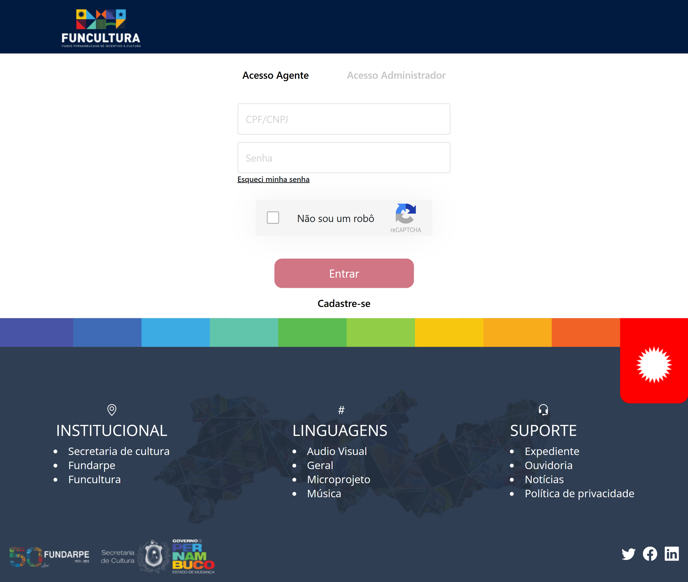
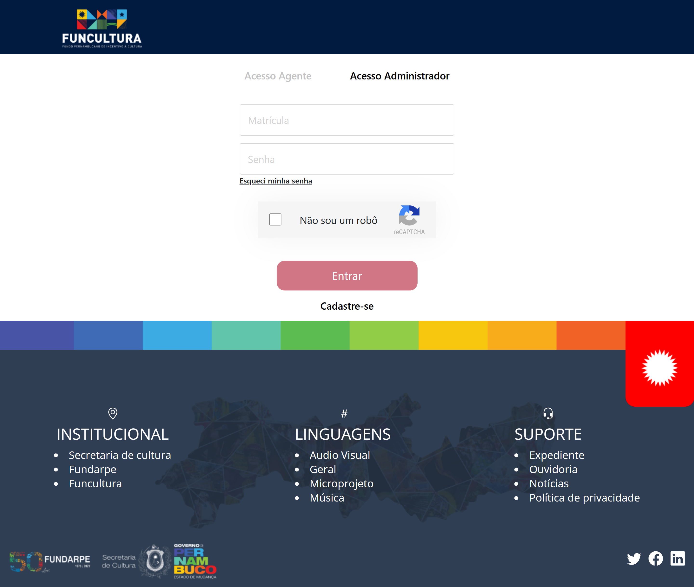

<h1 align="center"> Plataforma Web - Editais Fundarpe </h1>

# Badges

# Índice
* [Badges](#badges)
* [Índice](#índice)
* [Descrição do Projeto](#descrição-do-projeto)
* [Tecnologias utilizadas](#tecnologias-utilizadas)
* [Funcionalidades e Demonstração da Aplicação](#funcionalidades-e-demonstração-da-aplicação)
* [Pessoas Desenvolvedoras do Projeto](#pessoas-desenvolvedoras)

# Descrição do Projeto

 Desenvolvimento de uma plataforma web com novo layout - que respeita a identidade visual do governo de PE, para todas as páginas, que direciona o usuário até os editais e otimiza os formulários de inscrições considerando as particularidades dos editais. 

# :white_check_mark: Tecnologias Utilizadas
<ul>
  <li>Javascript</li>
  <li>CSS</li>
  <li>Git e Github</li>
  <li>React.js</li>
  <li>React-Bootstrap</li>
  <li>Node version managers(NPM)</li>
  <li>VS Code</li>
  <li>Netlify</li>
</ul>

# ⚙ Como Executar a Aplicação:

* Git clone 
* Acessar o diretorio clonado, utilize o git bash
* npm i
* npm start

# :hammer: Funcionalidades e Demonstração da Aplicação
`Tela Principal`: 
representa a tela principal da plataforma dedicada à promoção cultural e divulgação de eventos e editais.
 

 
A tela home é composta por 3 arquivos js: index, styled e constants. 

🛠️ O index.js representa a Tela Principal e está dividido em várias seções, cada uma representando um bloco ou uma parte específica da página. Todas as seções da página se encontram dentro do ContainerHome.

⭐ O styled.js representa os elementos de estilo da página principal.

⌨️ O constants.js representa os filtros de mês e categoria da seção de editais da página principal.

<h3>Da pasta Components foram importados os seguintes componentes:</h3>
<ul><li>CardHome</li>
<li>CarouselHome</li>
<li>Header</li>
<li>Footer</li></ul>

<h3>Dentro da pasta Card foram importados os seguintes componentes:</h3>
<ul><li>editalCard</li>
<li>eventsCard</li></ul>

<h3>Do react-bootstrap foram importados os seguintes componentes:</h3>
<ul><li>Dropdown</li>
<li>DropdownButton</li></ul>

<h3>Do arquivo styled.js foram importados os seguintes elementos:</h3>
<ul><li>SelectGroup</li>
<li>CardBox</li>
<li>ContainerHome</li>
<li>AboutBox</li>
<li>ButtonBox</li></ul>

<h3>Do arquivo constant.js foram importados os seguintes elementos:</h3>
<ul><li>meses</li>
<li>categorias</li></ul>

<h3>Da pasta assets foram importadas as seguintes imagens:</h3>
<ul><li>Banner1</li>
<li>Banner2</li>
<li>bridge</li></ul>

<h3>Dentro do ContainerHome teremos os seguintes componentes (alguns já importados acima):</h3>
<ul><li>Header: Contém informações do cabeçalho, como o nome de usuário, links para seções específicas (como institucionais), botões para registrar e sair, e uma opção para iniciar a sessão. </li>
<li>CarouselHome: Exibe informações de forma dinâmica e atrativa em um carrossel. Contém título, detalhe adicional e uma descrição mais aprofundada sobre a iniciativa do Governo de Pernambuco relacionada à cultura. </li>
<li>SelectGroup, CardBox e ButtonBox: Permite filtrar os editais por mês e categoria, exibindo uma lista de editais em cartões (CardHome). Além disso, inclui um botão para possibilitar a visualização de mais detalhes sobre os editais. </li>
<li>AboutBox: Seção informativa sobre o Funcultura PE, contendo um link para obter mais informações, uma imagem relacionada e um parágrafo detalhado explicando a origem, funcionamento e impacto do Funcultura.
<li>Div flex_container, flex_section e flex_imag: Seção visualmente rica, contendo imagens, vídeos e texto. Ela utiliza a flexibilidade do layout para organizar elementos visualmente de maneira atrativa e dinâmica.
<li>CardBox: Seção de eventos, onde cada evento é exibido por meio do componente CardHome. Os eventos são mapeados a partir do array eventsCard e apresentados em cartões. Cada cartão inclui informações relacionadas ao evento (título, imagem, data e descrição). </li>
<li>Footer: Representa o rodapé que contém informações institucionais, linguagens, suporte, logos e links para redes sociais. </li></ul>

 
 

`Tela de Login`: 
representa a tela de acesso do usuário à plataforma através das suas credenciais de autenticação seja ele um agente ou administrador.

A tela de login é composta por 3 arquivos js: Login, Login.Adm e styled.

🛠️ O Login.js representa a tela de login do Agente, indíviduo que participa de editais lançados pela Funcultura, competindo por recursos financeiros para a execução de projetos culturais específicos.

🛠️ O LoginAdm.js representa a tela de login do Administrador, indivíduo que realiza a gestão e manutenção da plataforma e dos editais divulgados.

⭐ O styled.js representa os elementos de estilo utilizados na tela de login.

<h3>Da pasta Components foram importados os seguintes componentes:</h3>
<ul><li>Header</li>
<li>Footer</li></ul>

<h3>Do react foi importado o seguinte componente:</h3>
<ul><li>React, useState</li></ul>

<h3>Do arquivo validations.js da pasta Utils foram importados os seguintes componentes:</h3>
<ul><li>cpfCnpjMask</li>
<li>validatePassword</li></ul>

<h3>Do react-router-dom foi importado o seguinte componente:</h3>
<ul><li>useNavigate</li></ul>

<h3>Do styled.js foram importados os seguintes componentes:</h3>
<ul><li>ContainerLogin</li>
<li>ReCaptcha</li>
<li>Acessos</li></ul>

<h3>Do LoginAdm.js foi importado o seguinte componente:</h3>
<ul><li>LoginAdm</li></ul>

<h3>Da pasta Form (dentro da pasta assets) foi importado o seguinte componente:</h3>
<ul><li>reCaptcha</li></ul>

<h3>Do react-bootstrap foi importado o seguinte componente:</h3>
<ul><li>Form</li></ul>

<h3>Antes da estrutura da página, foram utilizados os seguintes componentes funcionais de React:</h3>
<li>useState: Utiliza o Hook useState para gerenciar estados locais, incluindo form (para os dados do formulário), loading (para indicar se o processo de login está em andamento), cpfCnpj (para armazenar CPF ou CNPJ), e agente (para controlar se a tela exibe o formulário de agente ou administrador).</li>
<li>useNavigate: Utiliza o hook useNavigate para obter a função de navegação. A função navigate será usada para redirecionar o usuário após o login bem-sucedido.</li>
<li>showAgenteLogin/showAdminLogin: São funções que alteram o estado agente (setAgente), determinando qual formulário de login deve ser exibido. </li>
<li>handleSubmitUser: Chamada quando o formulário é enviado. Ela coleta os dados do usuário (CPF ou CNPJ e senha), os armazena no localStorage e redireciona o usuário para a página inicial.</li>
<li>handleCpfCnpj/handlerChange: Responsáveis por manipular mudanças nos campos de CPF/CNPJ e senha, respectivamente.</li>
<li>InputValidator: Verifica se a senha é válida (usando validatePassword) e se o comprimento do CPF/CNPJ é maior que 10.</li>
<li>isUserLoggedIn: Verifica se um usuário já está autenticado (tem uma sessão ativa) usando o localStorage. Se sim, redireciona imediatamente para a página inicial. A renderização do componente é condicional, se não houver usuário autenticado, o restante do componente é renderizado.</li>

<h3>A página de login é composta pelos seguintes componentes (alguns já importados e citados acima):</h3>
<li>Header: Representa as informações do cabeçalho, como a logo do funcultura por exemplo.</li>
<li>Acessos: Responsável por exibir dois botões que permitem alternar entre os modos de "Acesso Agente" e "Acesso Administrador". A mudança de estilo destaca visualmente o tipo de acesso selecionado. As funções showAgenteLogin e showAdminLogin alteram o estado do componente para refletir a escolha do usuário.</li>
<li>form: A renderização do código está condicionada ao valor da variável de estado agente. Se agente for verdadeiro renderiza um formulário de login para agentes, com campos para CPF/CNPJ, senha, opção de redefinição de senha, e um botão de entrada. O formulário inclui um ReCaptcha para melhorar a segurança durante o processo de login.</li>
<li>LoginAdm: Caso agente não seja verdadeiro, renderiza um formulário de login para administradores contendo campos para matrícula, senha, opção de redefinição de senha, um botão de entrada e ReCaptcha.</li>
<li>Footer: Mesmo rodapé utilizado em todas as páginas, contendo informações institucionais, linguagens, suporte, logos e links para redes sociais. </li>

 
 

`Tela de Cadastro`: 
A tela de cadastro foi idealizada para ser intuitiva e receptiva para o usuário, ela foi construída com uma interface familiar o que torna o processo de cadastramento confortável.

Para a construção da tela foi utilizado 2 arquivos js:

🛠️  index.js está dentro da pasta **pages** que são as telas de retorno para os usuários.

⭐ O styled.js foi onde trabalhamos a apresentação visual dos elementos.

⭐ Também importamos um arquivo styled.js do **Login**  que foi onde trabalhamos a apresentação visual dos elementos compartilhados.

<h3>Na construção utilizamos alguns componentes importados</h3>

<h3>Biblioteca React Bootstrap</h3>
<ul>
<li>React Bootstrap Form</li>
</ul>

<h3>Do react-router-dom foi importado o seguinte componente:</h3>
<ul><li>useNavigate (react-router)</li></ul>

<h3>Do react foi importado o seguinte componente:</h3>
<ul><li>useState (react)</li></ul>

<h3>Validações importadas para construção da tela</h3>
<ul><li>cpfCnpjMask</li>
<li>validatePassword</li>
</ul>

<h3>Componentes</h3>
<ul>
<li>Header</li>
<li>LoginHeader</li>
<li>Footer</li>
</ul>

<h3>Elementos de estilo</h3>
<ul>
<li>Acessos</li>
<li>ContainerRegister</li>
</ul>

<h3>Antes da estrutura da página, foram utilizados os seguintes componentes funcionais de React:</h3>

Uma const Register, uma função JavaScript que permite a identificação do tipo de perfil que será cadastrado, foi definido também uma const navigate, que é caracterizada pelo uso da função **useNavigate( )**. Também implementamos no código condições para validar se o usuário é um agente ou um administrador, funções como validação de senha e CPF.

Dentro dessa pasta podemos ver importes do React Bootstrap que nos auxiliou na construção da aplicação web e importes de outros componentes.

<h3>A página de Cadastro é composta pelos seguintes componentes (alguns já importados e citados acima):</h3>

<li>Header: Representa as informações do cabeçalho, como a logo do funcultura por exemplo.</li>

<li>LoginHeader: Incluímos o caminho para o usuário que busca cadastrar-se e criamos o formulário com os dados que eram necessários para o processo de cadastramento na plataforma.</li>

<li>Footer: Mesmo rodapé utilizado em todas as páginas, contendo informações institucionais, linguagens, suporte, logos e links para redes sociais. </li>

 
 

`Tela de Detalhes do Edital`: 
Cada edital possui sua particularidade, eles se dividem em Audiovisual, Geral, Microprojeto Cultural, Música e Parecerista. 

 Para a composição da tela de detalhes do edital temos 3 arquivos js:

🛠️ Um index.js está alocado dentro de uma pasta específica para a construção estrutural de detalhes de edital, nomeada como PublicNotice.  

🛠️ Um segundo index.js está dentro da pasta **pages** que são as telas de retorno para os usuários. 

⭐ O styled.js foi onde trabalhamos a apresentação visual dos elementos.

<h3>Na pasta Componentes do PublicNotice importamos bibliotecas, elementos e caminhos de outros componentes</h3>

<h3>Biblioteca React Bootstrap</h3>
<ul>
<li>React Bootstrap Icons</li>
<li>React Bootstrap (botão)</li>
</ul>

<h3>Do react-router-dom foi importado o seguinte componente:</h3>
<ul><li>useNavigate (react-router)</li></ul>

<h3>Componentes</h3>
<ul><li>editalCard</li></ul>

<h3>Elementos de estilo</h3>
<ul>
<li>Container</li>
<li>SectionOne</li>
<li>SectionTwo</li>
<li>SectionThree</li>
<li>SectionFour</li>
<li>Title</li>
<li>Image</li>
<li>FileIcon</li>
<li>LampIcon</li>
</ul>

<h3>Antes da estrutura da página, foram utilizados os seguintes componentes funcionais de React:</h3>

Uma const id, uma função JavaScript que permite nossa navegação entre (item.id), quando definida o que auxilia a otimizar o código, quando atribuirmos condições e determinamos como a aplicação deve se comportar na estruturação dos possíveis cenários e rotas para assim retornar ao usuário.  

Dentro dessa pasta podemos ver importes do React Bootstrap que nos auxiliou na construção da aplicação web e importes de outros componentes como os de edital que foi criado na tela de Home, de acordo com os requisitos funcionais da nossa aplicação estipulados pelo cliente.

<h3>A página de detalhes de edital é composta pelos seguintes componentes (alguns já importados e citados acima):</h3>

<li>Header: Representa as informações do cabeçalho, como a logo do funcultura por exemplo.</li>

<li>PublicNotice: Que carrega todos os importes estruturais e se divide em 1 container que abraça todo o corpo do nosso código, 4 sessões estruturais que delimitam as caixas de construção do conteúdo. 

  **Container:** utilizamos uma função map do JavaScript que funcionará em conjunto com a const id na navegação (useNavigate) entre os editais.

**SectionOne:** utilizamos uma 🔑 para poder habilitar essa navegação e trazer retornos distintos dependendo do edital que o usuário selecionar na aplicação.

**SectionTwo:** trouxemos a logo da secretaria da cultura que é a responsável pelos editais do Funcultura, trouxemos um link direcionável para que o usuário possa explorar o Mapa Cultural de Pernambuco. 

**SectionTree:** são informações complementares do edital e de suporte ao usuário.

**SectionFour:** é composta pela estruturação de direcionamento do usuário para mais informações para sua inscrição e o botão de inscrição de fato onde usamos a mesma ideia do __(map)__ que foi utilizada na SectionTwo, para direcionar o usuário para a inscrição do edital específico selecionado. 

<li>Footer: Mesmo rodapé utilizado em todas as páginas, contendo informações institucionais, linguagens, suporte, logos e links para redes sociais. </li>

 
 

`Tela de Inscrição do Edital`: 
representa a tela onde é exibido o formulário de inscrição para o edital escolhido pelo agente.

A tela de inscrição do edital é composta pelo arquivo index.js, que representa o formulário de inscrição.

<h3>Da pasta Components foram importados os seguintes componentes:</h3>
<ul><li>Header</li>
<li>Footer</li></ul>

<h3>Da pasta Forms (dentro da pasta components) foram importados os seguintes componentes:</h3>
<ul><li>ContainerFormPage</li>
<li>FormsPublicNotices</li>
<li>CheckBoxForm</li>
<li>publicForms</li>
<li>publicFormsTwo</li>
<li>checkboxForm</li>
<li>checkboxFormGeral</li>
<li>checkboxFormAudioV</li>
<li>checkboxFormM</li>
<li>checkboxFormParecerista</li></ul>

<h3>Da pasta PublicNotice (dentro da pasta components) foram importados os seguintes componentes:</h3>
<ul><li>FileIcon</li>
<li>LampIcon</li></ul>

<h3>Da pasta Card (dentro da pasta components) foi importado o seguinte componente:</h3>
<ul><li>editalCard</li></ul>

<h3>Do react-bootstrap foi importado o seguinte componente:</h3>
<ul><li>Button</li></ul>

<h3>Do react-bootstrap-icons foram importados os seguintes componentes:</h3>
<ul><li>FileText</li>
<li>Lightbulb</li>
<li>Download</li></ul>

<h3>A página de inscrição é composta pelos seguintes componentes (alguns já importados e citados acima):</h3>
<li>const id: Extrai o ID da URL atual sendo parte final da rota. O ID é usado posteriormente para condicionalmente renderizar diferentes seções do formulário com base no conteúdo do objeto editalCard.</li>
<li>sectionZero: Seção de introdução ao formulário de inscrição, apresentando informações como cabeçalho da página, ícones, detalhes do edital com base no ID da URL e um número de inscrição fictício. As classes CSS sugerem estilos específicos aplicados a diferentes partes desta seção.</li>
<li>h1: Apresenta o título do formulário de inscrição. </li> 
<li>editalCard.map((item): Mapeia sobre o array editalCard e renderiza seções específicas do formulário com base nas categorias e no ID da URL. É verificada a categoria de cada item em editalCard e renderizada uma seção específica (sectionOne) com base nessa categoria. Cada seção contém um conjunto de checkboxes representados pelo componente CheckBoxForm.

 

Se a categoria for "musica", renderiza checkboxes de checkboxForm.
Se a categoria for "geral", renderiza checkboxes de checkboxFormGeral.
Se a categoria for "audiovisual", renderiza checkboxes de checkboxFormAudioV.
Se a categoria for "microprojeto", renderiza checkboxes de checkboxFormM.
Se a categoria for "parecerista", renderiza checkboxes de checkboxFormParecerista.

 

<li>É atribuída uma chave única (key) a cada seção com base no ID do item em editalCard. As chaves únicas são importantes para o React efetuar uma renderização eficiente de listas dinâmicas.</li>
<li>sectionTwo: Representa a segunda seção do formulário, que se concentra em coletar informações sobre os dados pessoais do usuário, usando o array publicForms para dinamicamente renderizar os campos específicos do formulário.</li>
<li>sectionThree: Representa a terceira seção do formulário, que se concentra em coletar informações relacionadas à autodeclaração do usuário, utilizando o array publicFormsTwo para dinamicamente renderizar os campos específicos do formulário.</li>
<li>sectionFour: Fornece informações sobre como o usuário pode anexar documentos, incluindo instruções sobre o método de upload e requisitos, além de fornecer botões para salvar e finalizar a inscrição. </li>
<li>Footer: Mesmo rodapé utilizado em todas as páginas, contendo informações institucionais, linguagens, suporte, logos e links para redes sociais.</li>

 
 

`Tela de Perfil (Agente)`: 
representa a tela onde o agente visualiza suas informações pessoais além de suas inscrições, notificações, conexões e documentações.

.png>)

A tela de perfil do agente é formada por 3 arquivos js: constantsAccount, index e styled.

🛠️ O arquivo index.js representa a tela de perfil do agente.

⭐ O arquivo styled.js representa os elementos de estilo utilizados na tela de perfil.

📜 O arquivo constantAccount.js representa a lista de etapas (steps) e etapas concluídas (stepsFinished) em um processo de submissão a um edital. Cada etapa é representada como um objeto dentro de um array.

<h3>Da pasta components foram importados os seguintes componentes:</h3>
<ul><li>Header</li>
<li>Footer</li></ul>

<h3>Da pasta Profiles (dentro da pasta components) foi importado o seguinte componente:</h3>
<ul><li>ProfileHeaders</li></ul>

<h3>Da pasta Profile (dentro da pasta assets) foram importados os seguintes componentes:</h3>
<ul><li>avatarUser</li>
<li>cardEdital</li>
<li>cardEdital2</li></ul>

<h3>Do arquivo styled.js foram importados os seguintes componentes:</h3>
<ul><li>NoticeSummary</li>
<li>Wrapper</li>
<li>Legend</li></ul>

<h3>Do arquivo constantsAccount.js foram importados os seguintes componentes:</h3>
<ul><li>steps</li>
<li>stepsFinished</li></ul>

<h3>Do arquivo styled.js da pasta de AdminDetails foram importados os seguintes componentes:</h3>
<ul><li>ContainerTable</li>
<li>Table</li>
<li>ThOne</li>
<li>ThTwo</li>
<li>ThTree</li>
<li>ThFour</li>
<li>ThFive</li>
<li>stepsFinished</li></ul>

<h3>Do react foi importado o seguinte componente:</h3>
<ul><li>useState</li></ul>

<h3>A página de perfil do agente é composta pelos seguintes componentes (alguns já importados e citados acima):</h3>
<li>Account: Utiliza o hook useState para gerenciar dois estados, inscricoes e documentacoes, estados booleanos que indicam se a seção de inscrições ou a seção de documentações deve ser exibida.</li>
<li>mostarInscricao: Define inscricoes como true e documentacoes como false, indicando que a seção de inscrições deve ser exibida.</li>
<li>mostrarDoc: Define inscricoes como false e documentacoes como true, indicando que a seção de documentações deve ser exibida.</li>
<li>Wrapper: Cria uma estrutura visual para representar o cabeçalho e informações do perfil de um usuário, incluindo a ocupação e uma opção para seguir o perfil. O estilo e comportamento desses componentes dependeriam da implementação específica dos componentes Header e ProfileHeaders.</li>

<h4>Dentro do Wrapper temos os seguintes componentes:</h4>
<li>ContainerTable: Cria uma tabela com um cabeçalho que inclui títulos de colunas e alguns estilos condicionais baseados em variáveis de estado (inscricoes e documentacoes). Quando as colunas "Inscrições" ou "Documentações" são clicadas, as funções mostarInscricao ou mostrarDoc são acionadas, respectivamente.</li>
<li>inscricoes: Renderiza uma seção dedicada às inscrições, incluindo informações sobre o progresso, o histórico e uma legenda, dependendo do valor da variável de estado inscricoes.</li>
<li>documentacoes: Renderiza dinamicamente um elemento div com o texto "Documentações" com base no valor da variável documentacoes. Se documentacoes for verdadeira, o elemento será renderizado; caso contrário, não será renderizado.</li>
<li>Footer: Mesmo rodapé utilizado em todas as páginas, contendo informações institucionais, linguagens, suporte, logos e links para redes sociais.</li>

 
 

`Tela de Perfil (Administrador)`: 
representa a tela onde o administrador visualiza suas informações pessoais além de suas inscrições, notificações, pareceristas e documentações para análise.

A tela de perfil do administrador é formada por 2 arquivos js: index e styled.

🛠️ O arquivo index.js representa a tela de perfil do administrador.

⭐ O arquivo styled.js representa os elementos de estilo utilizados na tela de perfil.

<h3>Da pasta components foram importados os seguintes componentes:</h3>
<ul><li>Header</li>
<li>Footer</li></ul>

<h3>Da pasta Profiles (dentro da pasta components) foi importado o seguinte componente:</h3>
<ul><li>ProfileHeaders</li></ul>

<h3>Da pasta Profile (dentro da pasta assets) foram importados os seguintes componentes:</h3>
<ul><li>avatar</li></ul>

<h3>Do arquivo styled.js foram importados os seguintes componentes:</h3>
<ul><li>Documentations</li>
<li>WrapInscription</li>
<li>WrapCard</li>
<li>SelectGroup</li>
<li>WrapDoc</li>
<li>ContainerTable</li>
<li>Table</li>
<li>ThOne</li>
<li>ThTwo</li>
<li>ThTree</li>
<li>ThFour</li>
<li>ThFive</li></ul>

<h3>Do arquivo styled.js da pasta Home foram importados os seguintes componentes:</h3>
<ul><li>ButtonBox</li>
<li>CardBox</li></ul>

<h3>Da pasta Card (dentro da pasta components) foram importados os seguintes componentes:</h3>
<ul><li>CardHome</li>
<li>editalCard</li></ul>

<h3>Do arquivo constants.js (dentro da pasta Home) foram importados os seguintes componentes:</h3>
<ul><li>categorias</li>
<li>meses</li></ul>

<h3>Do react-bootstrap foram importados os seguintes componentes:</h3>
<ul><li>DropdownButton</li>
<li>Dropdown</li>
<li>Form</li></ul>

<h3>Do react foi importado o seguinte componente:</h3>
<ul><li>useState</li></ul>

<h3>A página de perfil do administrador é composta pelos seguintes componentes (alguns já importados e citados acima):</h3>
<li>AdminDetails: Inicializa dois estados de componente, inscricoes e documentacoes, utilizando o hook useState. Esses estados podem ser utilizados para controlar o comportamento e a renderização condicional dentro do componente AdminDetails com base nesses valores de estado.</li>
<li>mostrarCard: Atualiza os estados do componente AdminDetails, configurando inscricoes como true e documentacoes como false indicando que a seção de inscrições deve ser exibida.</li>
<li>mostrarDoc: Define inscricoes como false e documentacoes como true, indicando que a seção de documentações deve ser exibida.</li>

<h4>Dentro de uma div, teremos os seguintes componentes:</h4>
<li>Header: Renderiza um componente de cabeçalho com o nome de usuário.</li>
<li>ProfileHeaders: Renderiza um componente de perfil que inclui uma foto (photo), nome (name), e ocupação (occupation).</li>
<li>ContainerTable: Cria uma tabela com um cabeçalho interativo, onde as colunas "Inscrições" e "Documentações" têm estilos condicionais e estão associadas a funções (mostrarCard e mostrarDoc, respectivamente) que provavelmente controlam o conteúdo exibido no restante do componente com base nessas interações.</li>
<li>inscricoes: Renderiza uma seção específica do conteúdo quando a variável inscricoes é verdadeira, incluindo um título, seletores, cartões e um botão "Ver mais".</li>
<li>documentacoes: Renderiza uma seção específica do conteúdo quando a variável documentacoes é verdadeira, incluindo um título, um seletor de formulário, e uma tabela com informações detalhadas sobre usuários. </li>

 
 

# Pessoas Desenvolvedoras do Projeto
| [ Ana Beatriz Lira](https://github.com/anabsl) | [ Anderson Fernandes](https://github.com/AndersonFernandes-dev) | [ Artur Ramos](https://github.com/Arturdev05) | [ Beatriz Rodrigues](https://github.com/Beatriz-Rodriguesx) | [ Beatriz Silva](https://github.com/BiaSilvaa) | [ Carlos Lima](https://github.com/CarlosDev258) | [ Flavia Favacho](https://github.com/flaviafavacho) | [ Gabriel Oliveira](https://github.com/gabrieloliveiraa05) | [ Joana D'Arc](https://github.com/joanadarc84) | [ Kelvia Santos](https://github.com/kelvia-snts) | [ Rennan Reis](https://github.com/rennan2020) |
| :---: | :---: | :---: | :---: | :---: | :---: | :---: | :---: | :---: | :---: | :---: |